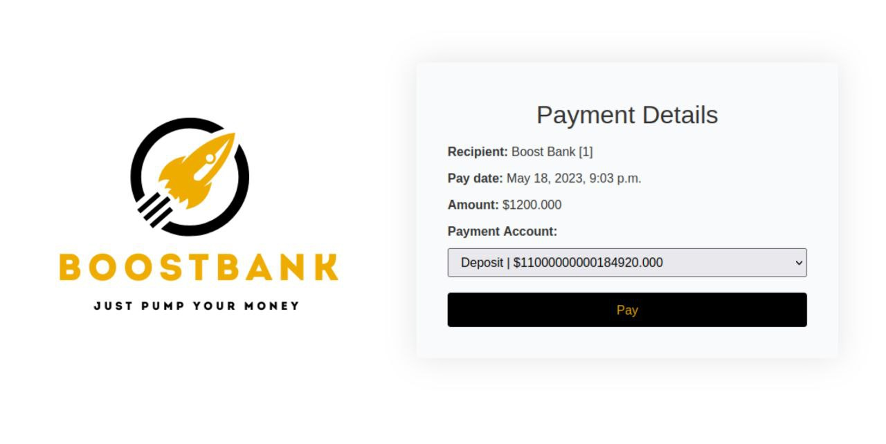
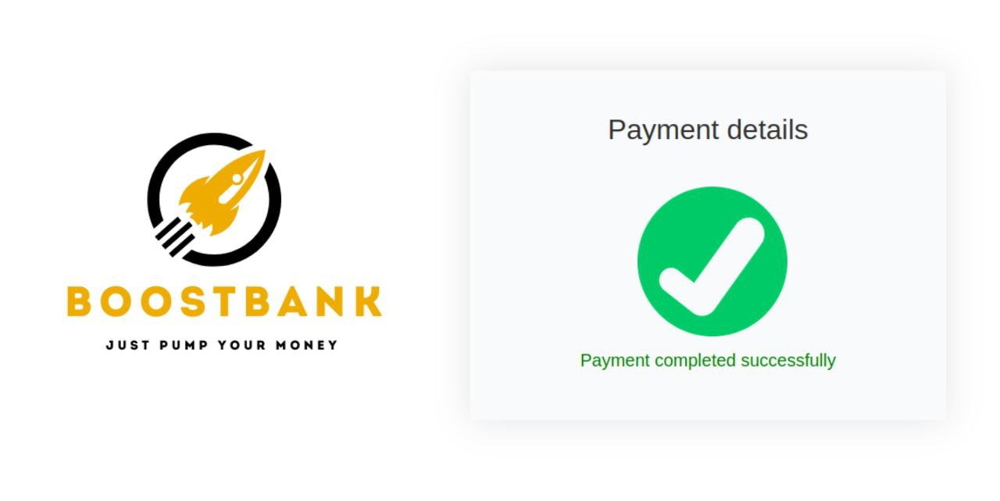
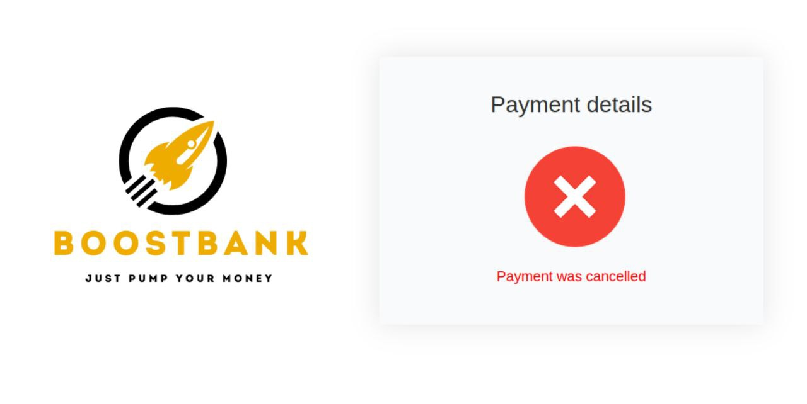
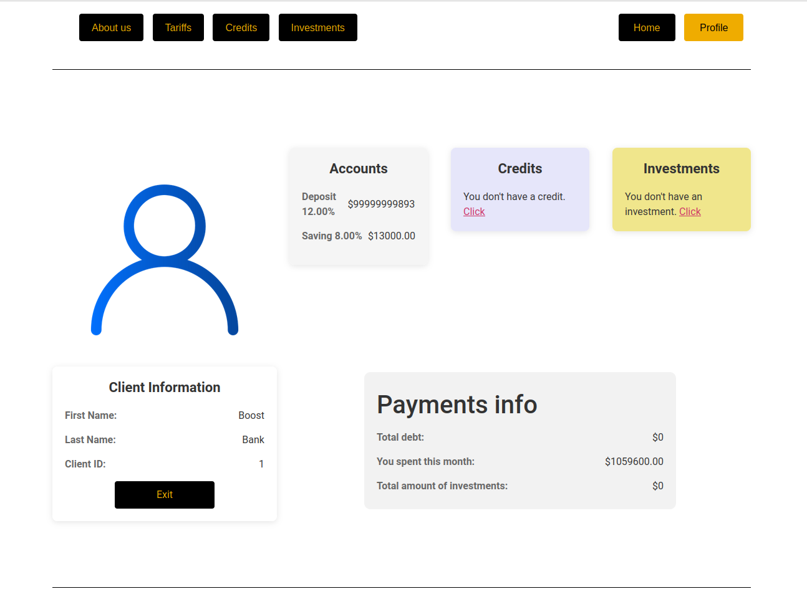
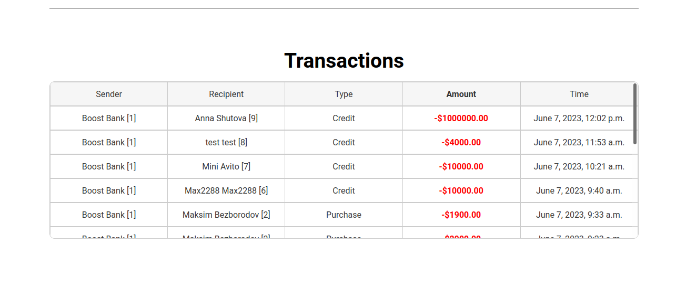
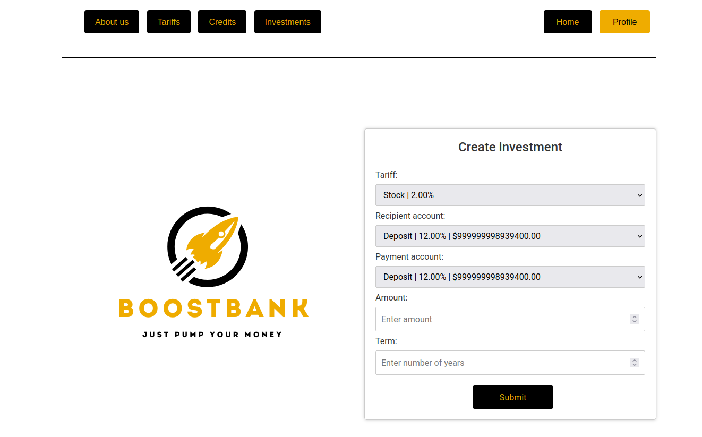
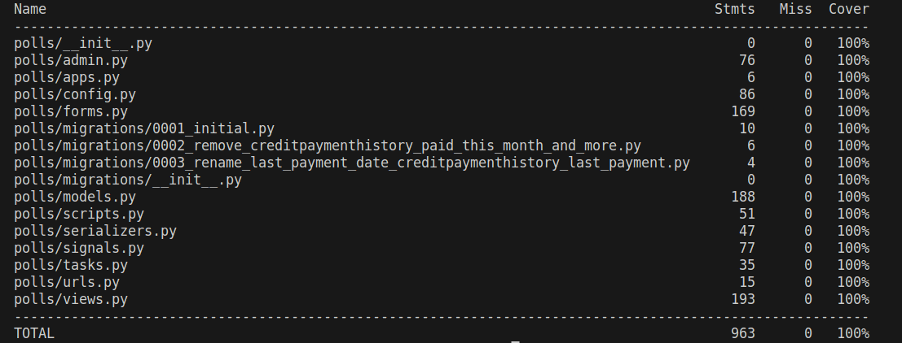

# About project

- Used by the Celery to check the relevance of the statuses of payment models.
- Payment integration system that returns a callback to the service sender of the payment status (confirmed / cancelled).
- Django Signals is used, with the help of which all the necessary objects are created during the first migration, the creation of new payment objects is processed (for example: if a transaction was created, then the money is transferred by signals)
- At the moment, the integration of the payment system in 4 training projects has been successfully implemented.

- Positive result

- Negative result

# Personal account

- A client's personal account has been implemented, where you can take a loan, invest money and make transfers between accounts.
- The page layout was done with Elementor (WordPress), but 95% of the page elements inserted by my code.

- Transactions table.

- Form for create investment.

# Test results

- The project is 100% tested.

# Install

- pip install -r requirements.txt

# env

- PG_HOST: postgresql host
- PG_USER: postgresql username
- PG_PASSWORD: postgresql password
- PG_PORT: postgresql port
- PG_DBNAME: postgresql dbname
- REDIS_HOST: redis host
- REDIS_PORT: redis port
- SECRET_KEY: django secret key
- ADMIN_USERNAME: admin username for create
- ADMIN_PASSWORD: admin password for create
- ADMIN_FIRST_NAME: admin first name for create
- ADMIN_LAST_NAME: admin last name for create
- ADMIN_EMAIL: admin email for create
- ADMIN_PHONE_NUMBER: admin phone number for create

# First run
- docker run -d --name bank_project -p 5437:5432 -v $HOME/postgres/bank_project:/var/lib/postgres/bank_project -e POSTGRES_PASSWORD=change_me -e POSTGRES_USER=test -e POSTGRES_DB=bank postgres
- docker run -d -p 127.0.0.1:6379:6379 --name my-redis redis
- fill the env
- python3 manage.py makemigrations bank_app
- python3 manage.py migrate
- chmod +x startserver.sh
- startserver.sh